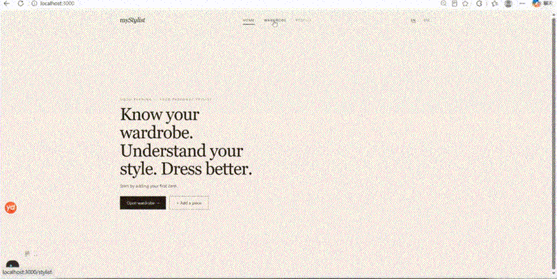

# myStylist — Digital Wardrobe

> Know your wardrobe. Understand your style. Dress better.

A self-hosted digital wardrobe + outfit sticker-board app: upload photos of your own clothes, the AI cuts them out (GroundingDINO + BRIA RMBG-1.4), each piece becomes a transparent sticker, and you can freely compose outfits on a board and save them. Bilingual UI (Chinese / English).



## Features

| Feature | Description |
|---|---|
| Digital wardrobe | Upload clothing photos, local AI matting (detect → mask → mask editor), save with name + category |
| Smart cut-out | Local Python service (GroundingDINO-tiny detection + BRIA RMBG-1.4 background removal, SAM2-tiny kept as fallback) with live progress stream; falls back to manual painting when the service is unavailable |
| Mask editor | Meitu-style green mask: brush / eraser / undo / redo, adjustable brush size |
| Sticker board | `/stylist` — wardrobe on the left (search, delete), board on the right: drag stickers, resize, rotate (snaps to 45°), save outfits |
| Saved outfits | Profile shows the 3 most recent, `/profile/saved` shows all, with delete |
| Bilingual | 中文 / English, driven by the `lang` cookie |

## Tech Stack

- **Frontend**: Next.js 16 (App Router, Turbopack) + React 19 + Tailwind CSS v4 + TypeScript
- **Data**: JSON file store (`data/store.json`, auto-created and auto-migrated at runtime), no external database
- **AI matting**: Python + FastAPI sidecar (`tools/matting/`), GroundingDINO-tiny detection + BRIA RMBG-1.4 segmentation (SAM2-tiny fallback); GPU (CUDA) optional, CPU-only works too

## Project Structure

```
├── src/
│   ├── app/                    # Next.js App Router pages + API routes
│   │   ├── page.tsx            # / home
│   │   ├── stylist/            # /stylist wardrobe + sticker board (core page)
│   │   ├── wardrobe/           # /wardrobe (redirect), /wardrobe/add (upload + matting), /wardrobe/[id]
│   │   ├── profile/            # /profile, /profile/saved (all saved outfits)
│   │   ├── outfit/[id]/        # saved outfit detail
│   │   └── api/                # wardrobe / outfits / ai-classify / reset routes
│   ├── components/             # UI (MattingEditor, CutoutEditor, ConfirmDialog, …)
│   ├── i18n/                   # zh.ts / en.ts dictionaries (no hardcoded copy in components)
│   └── lib/
│       ├── db/                 # store.ts (JSON repository, auto-creates dirs & migrates) + seed.ts
│       ├── services/ai.ts      # AI abstraction layer (classification hints)
│       ├── client/             # client-side image helpers (upload compression, sticker rendering)
│       └── types.ts            # data models
├── tools/matting/              # AI matting Python service (see its README)
├── scripts/                    # asset generation/fetch scripts (optional, not required at runtime)
├── data/                       # created at runtime (gitignored, never committed)
└── public/uploads/             # matting output (created at runtime, gitignored, never committed)
```

## Getting Started

### 1. Frontend

Requires Node.js ≥ 20.

```bash
npm install      # first time only
npm run dev      # → http://localhost:3000
```

On first launch, `data/` and `public/uploads/` are created automatically. The wardrobe starts empty — upload your own clothes to get going.

### 2. AI matting service (optional, recommended)

Requires Python ≥ 3.10. One command on Windows:

```bat
tools\matting\run.bat
```

On first run it: creates `.venv` → installs dependencies (torch ~2.5GB) → downloads model weights (~1GB) → serves `http://127.0.0.1:8001`. Model downloads default to the HF mirror, so no extra setup is needed on China networks.

**macOS / Linux** (no one-click script — start it manually):

```bash
python -m venv tools/matting/.venv
tools/matting/.venv/bin/pip install -r tools/matting/requirements.txt
tools/matting/.venv/bin/python -m uvicorn service:app --app-dir tools/matting --host 0.0.0.0 --port 8001
```

- **GPU acceleration**: `run.bat` auto-detects an NVIDIA GPU and installs CUDA torch wheels from the SJTU wheel index; without a GPU it keeps CPU torch (slower, ~15–30s per photo).
- **The app works without this service**: after uploading, it automatically falls back to manual painting mode — brush over the part to keep.

Model weights are **not distributed with this repo** — `download-models.py` downloads everything on first run.

## AI Matting Pipeline

Clothing cut-out runs **100% locally** — no cloud APIs, no image generation; real garment pixels only. The photo goes through four stages in the Python sidecar (`tools/matting/service.py`):

```
photo
  ↓  1. GroundingDINO-tiny   — open-vocabulary detection → garment bounding box
  ↓  2. ROI crop             — box padded by 12% (clamped to frame) → 1024×1024
  ↓  3. BRIA RMBG-1.4        — foreground/background separation → soft alpha mask
  ↓  4. Health gates         — failed masks trigger the SAM2-tiny fallback
  ↓  green overlay PNG (original resolution) streamed to the browser
  ↓  user brushes in/out in the mask editor → client-side 512×512 sticker
```

1. **Detect** — GroundingDINO-tiny (via transformers) finds the garment and returns
   the best bounding box plus a category hint (e.g. `tops`) used to pre-fill the
   upload form.
2. **Crop** — the box is padded 12% on every side so thin straps and soft edges
   survive, then resized to the model's native 1024×1024 input.
3. **Segment** — BRIA RMBG-1.4 produces a soft alpha mask, which is thresholded,
   cleaned, feathered, and pasted back into full-photo coordinates.
4. **Verify & fall back** — the mask must pass health gates (non-empty, not the
   whole frame, colors must not match the border background). Failures trigger
   the **SAM2-tiny fallback** (lazy-loaded only on demand). If both models fail
   — or the service is down entirely — the browser switches to **manual
   painting**, so an upload never hard-fails.

The result streams to the browser as a **green overlay PNG at the original photo
resolution** (green = keep region, NDJSON progress stages). The user can brush
in/out in the mask editor (`CutoutEditor`), and the final 512×512 transparent
sticker is computed **client-side** — the server only ever produces the mask.

**Why RMBG-1.4 over pure SAM2:** RMBG is trained for e-commerce imagery and
handles the hard cases in wardrobe photos far more reliably — white garment on
white background, studio highlights, thin straps, blurry edges. SAM2 remains as
a safety net. Model weights download on first run (`download-models.py`,
~1GB); details, API, and smoke tests in [`tools/matting/README.md`](tools/matting/README.md).

---

## Environment Variables (all optional)

| Variable | Default | Description |
|---|---|---|
| `NEXT_PUBLIC_MATTING_URL` | `http://localhost:8001` | Matting service base URL |
| `MYSTYLIST_MODELS_DIR` | `tools/matting/models` | Model storage directory |
| `MYSTYLIST_UPLOAD_DIR` | `public/uploads` | Matting output directory |
| `HF_ENDPOINT` | (official) | Use `https://hf-mirror.com` in China |

See `.env.example`.

## Data & Privacy

- All user data (wardrobe, outfits) lives in local `data/store.json`, **excluded via .gitignore**.
- Uploaded photos and cut-out results live in local `public/uploads/`, **also excluded from version control**.
- This repo contains no user photos, no runtime data, no model weights, no API keys.

## License

MIT
